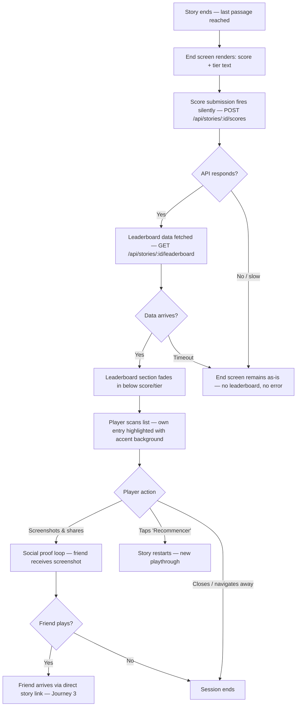
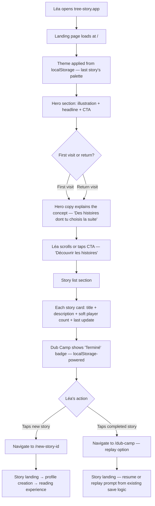
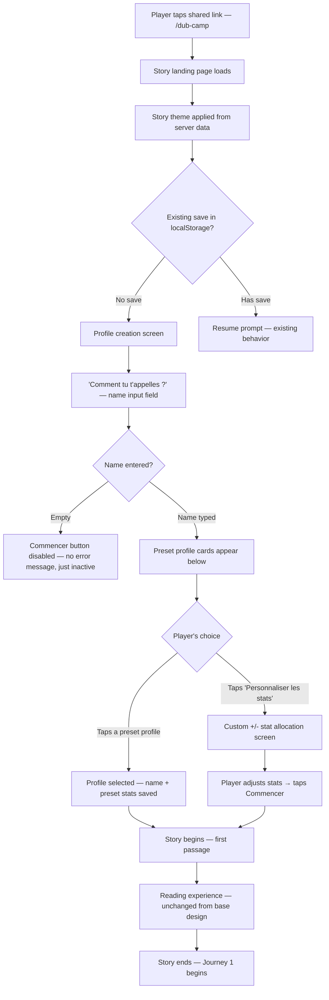

# UX Design Specification — Server Capabilities

**Author:** Anthony
**Date:** 2026-03-04

**Scope:** This document covers UX design for the four server-driven features introduced in the PRD: leaderboard, player name capture, multi-story support, and live story updates. It builds on the established design foundation in `ux-design-specification.md` (typography, color system, gauge strip, choice cards, theme acts).

---

<!-- UX design content will be appended sequentially through collaborative workflow steps -->

## Executive Summary

### Project Vision

tree-story's server capabilities extend a fully static, zero-friction interactive fiction app into a hybrid client-server product — without changing what it feels like to play. Four features drive this shift: a leaderboard where players see how their score compares to friends who finished the same story, player name capture at character creation, multi-story support with a story listing page, and live story updates without redeployment. The tone remains intimate: the leaderboard is a shared scoreboard between friends, not a competitive ranking. The server layer is infrastructure for growth, not a product pivot.

### Target Users

**Léa (existing persona, new touchpoints):** Léa's core behaviour is unchanged — metro bursts, zero friction, gut-driven choices. Two new moments enter her journey: seeing her score among other players on the end screen (a social proof trigger that invites screenshots and sharing), and discovering a second story from a listing page after finishing her first. Neither moment introduces accounts, tutorials, or friction.

**New player via direct link:** Arrives at a shared URL (`/dub-camp`), lands directly on the story — no listing page, no detour. Enters their name at character creation (the only new input), plays through, sees the leaderboard at the end. The experience is indistinguishable from the current product except for the name field and the leaderboard.

**Anthony (admin):** Updates story content live via API without git commits or redeployment. No player-facing UX implications — this is an infrastructure concern.

### Key Design Challenges

1. **Leaderboard without breaking the intimate tone** — The end screen's emotional register is personal and reflective (score reveal, tier text). A ranked list risks shifting it to competitive. The leaderboard must feel like glancing at a shared scoreboard at a festival, not a ranked ladder.

2. **Name input without onboarding friction** — The first "form-filling" moment in tree-story. It must integrate into the existing profile creation flow as naturally as stat allocation — part of the story setup, not an account creation gate.

3. **Story listing without app-store aesthetics** — The first screen in tree-story that isn't story content. It must stay coherent with the typographic, dark-mode identity — a bookshelf, not a product catalog.

4. **Graceful degradation for a small server** — Leaderboard API unreachable? End screen still renders the player's score and tier. Story API unreachable? A meaningful fallback, not a blank screen. Server failures are expected at this scale.

### Design Opportunities

1. **Leaderboard as sharing trigger** — Designed to be screenshot-worthy. Léa sends her rank to the friend who shared the link. The leaderboard is a social proof mechanism before it's a feature.

2. **Story listing as narrative invitation** — Minimal, typographic, curious. Each story presented as a door to a world, not a product card with ratings and categories.

3. **Completion state as gentle progress** — A "Terminé" badge on finished stories connects Léa's play history without accounts. localStorage-powered, zero-friction.

## Core User Experience

### Defining Experience

The server capabilities introduce three new interaction surfaces to tree-story, each with a distinct core action:

- **Leaderboard (end screen):** A glance — not an exploration. Léa finishes, sees her score and tier text as before, then scans a short list of other players' names and scores. She locates herself in 3 seconds. The interaction is closer to checking a scoreboard pinned to a wall than browsing a ranking page.

- **Name input (profile creation):** A single required text field integrated into the existing stat allocation flow. It's the first thing on the profile screen — "Comment tu t'appelles ?" — before the +/- stat distribution. It reads as character identity, not account registration.

- **Story listing (landing page):** A true landing page that serves two roles: it explains what tree-story is (for someone arriving without context) and presents the available stories below. Each story shows title, short description, last update date, and a soft player count ("quelques joueurs" / "une dizaine de joueurs"). The page uses the visitor's last story theme via localStorage, or app shell defaults for first-time visitors.

### Platform Strategy

No changes to the established platform strategy. All new features are mobile-first, dark-mode, touch-optimized. The landing page is the only new screen — it must work as a shareable URL (`/`) and as a return destination for players who've finished a story.

**Theme continuity on the landing page:** CSS custom properties are set from the visitor's last active story theme (persisted in localStorage). If Léa last played Dub Camp during the "Night" act, the landing page feels like returning to that world. First-time visitors see app shell defaults (`--color-bg: #0f0f0f`, `--color-accent: #d4935a`).

### Effortless Interactions

The following must require zero conscious effort:

- **Score submission** — Happens automatically at story end. Fire-and-forget. The player never knows an API call occurred.
- **Leaderboard loading** — Appears on the end screen without a loading spinner or separate tap. If the API is slow, the score and tier text render first; the leaderboard fades in when ready.
- **Theme persistence on landing page** — The page feels familiar without the player understanding why. The last story's palette is applied silently via localStorage.
- **Completion state on story listing** — A "Terminé" badge appears on stories the player has finished. localStorage-powered, no account needed, no action required.

### Critical Success Moments

1. **The leaderboard glance** — Léa sees her name, her score, and where she sits among friends. The moment triggers a screenshot and a message: "T'as fait combien toi ?" If this moment doesn't feel share-worthy, the leaderboard has failed.

2. **The name field** — The player types their name and moves on. If it feels like signing up for something, it has failed. If it feels like naming their character, it has succeeded.

3. **The landing page first impression** — Someone types `tree-story.app` or follows a root link. Within 3 seconds they understand what this is and see stories they can tap. If it feels like an app store or a dashboard, it has failed. If it feels like the entrance to a quiet bookshop, it has succeeded.

4. **Graceful degradation** — The leaderboard API is down. Léa finishes her story and sees her score and tier text exactly as before. She doesn't know a leaderboard was supposed to be there. The absence is invisible.

### Experience Principles

1. **Server features are invisible plumbing** — The player never perceives a client-server boundary. Scores submit silently. Stories load from an API the same way they loaded from a static file. The server exists; the player doesn't know.

2. **New screens inherit the story's voice** — The landing page and leaderboard use the same typographic and color language as the reading experience. Inter for mechanical elements, story-themed palette, generous dark space. No new visual register is introduced.

3. **Social proof, not competition** — The leaderboard invites sharing ("look where I ended up"), not optimization ("how do I get a higher score"). Soft language, no podium, no medals.

4. **Every new input earns its place** — The name field is the only new friction point across all server features. It must justify itself by making the leaderboard personal. Nothing else asks the player to type, tap, or decide beyond what the base experience already requires.

## Desired Emotional Response

### Primary Emotional Goals

The server capabilities introduce three emotionally distinct moments. Each extends the base design's emotional register (absorbed, curious, agency without pressure) without contradicting it:

1. **Shared experience** (leaderboard) — The feeling of seeing other names alongside yours on a guestbook, not a podium. "Other people were here too." Warm, not competitive. The emotional payoff is belonging to a small group, not beating them.

2. **Self-identification** (name input) — "This is me in this story." The same playful, character-building register as stat allocation. The name field is an act of self-expression, not a form submission.

3. **Curiosity and warmth** (landing page) — Two registers for two visitors. A first-time visitor feels intrigued: "what is this?" A returning player feels recognised: "ah, I remember this." The theme persistence from their last story creates subliminal familiarity.

### Emotional Journey Mapping

| Moment | Target emotion | Emotion to avoid |
|---|---|---|
| Name field at profile creation | Self-identification, playfulness | "Am I creating an account?" |
| Score submission at story end | Nothing — invisible | Anxiety about network, loading |
| Leaderboard appears on end screen | Mild surprise, shared belonging | Competitive pressure, "I lost" |
| Scanning the leaderboard | Social warmth, screenshot impulse | Ranking anxiety, envy |
| Landing page — first visit | Curiosity, invitation | Confusion, "is this an app store?" |
| Landing page — return visit | Warmth, familiarity | Disorientation, "where's my story?" |
| Tapping a story from the listing | Anticipation, stepping into a new world | Decision paralysis |
| Server error / API down | Nothing — absence is invisible | Frustration, broken experience |

### Micro-Emotions

- **Belonging** over Isolation — The leaderboard says "you're part of this." Not in a community-platform way, but in a "friends who passed through the same place" way.
- **Recognition** over Anonymity — Seeing your name on the leaderboard makes it personal. The name field's friction is justified by this payoff.
- **Invitation** over Obligation — The landing page invites exploration. No story demands to be played. No progress bar shames unfinished content.
- **Trust** over Suspicion — No data collection beyond a first name. No account. No email. The player gives their name to the story, not to the platform.

### Design Implications

- *Shared experience* → Leaderboard styled as a simple list, not a ranked table. No medals, no podium, no position numbers that draw attention to rank. Names and scores, softly presented.
- *Self-identification* → Name field styled consistently with stat allocation UI (Inter, same input styling). Prompt in story voice ("Comment tu t'appelles ?"), not in platform voice ("Enter your username").
- *Curiosity* → Landing page headline is evocative, not descriptive. Suggests what tree-story feels like, not what it technically is. Story cards reveal just enough to create pull.
- *Warmth on return* → Theme persistence from last story creates an emotional anchor. The landing page is tinted with the player's most recent story world — a subtle "welcome back."
- *Invisible failure* → No error modals, no "retry" buttons, no "could not load leaderboard" messages. The end screen is complete without the leaderboard; the leaderboard is an enhancement that appears when available.

### Emotional Design Principles

1. **The leaderboard is a guest book, not a scoreboard** — Design every element to reinforce "shared experience" over "competition." If a design choice makes a player feel like they lost, it's wrong.
2. **Warmth through continuity** — The landing page's theme persistence is an emotional design decision, not a technical one. It says "we remember you" without storing anything personal.
3. **Absence over error** — When server features fail, the player experience is subtraction (the leaderboard simply isn't there), never addition (no error message, no broken UI element, no retry prompt).
4. **The name is a gift to the story** — Frame name input as something the player gives to their character, not something the platform collects. The copy, the styling, and the placement must all reinforce this.

## UX Pattern Analysis & Inspiration

### Inspiring Products Analysis

**Wordle (social proof model)** — No in-app leaderboard exists. The entire social layer is a screenshot shared in a message thread. The emotional payload is "look what I got" between friends — never "I beat you." Wordle proved that intimate social proof doesn't need infrastructure; it needs a moment worth sharing. tree-story's leaderboard is more explicit (it shows other players' names and scores), but the emotional register is identical: the value is in the screenshot sent to a friend, not in the ranking itself.

**Strava segments (friends-first leaderboard)** — The segment leaderboard shows people you know before the global ranking. It feels like a shared activity log — "we all ran this hill" — not a competition. The intimacy comes from scale: a dozen friends, not ten thousand strangers. Directly relevant for tree-story's "scoreboard at a festival" tone. The key lesson: when the list is short and familiar, ranking emerges naturally without needing to be designed as a feature.

**Are.na (minimal content browsing)** — Dark-mode-native, typographic, zero-chrome content discovery. No ratings, no categories, no algorithmic sorting. Just blocks of content with generous whitespace. The browse experience feels like wandering, not shopping. Relevant for the landing page's "bookshelf, not app store" principle. Are.na proves that minimal metadata (title + brief description) is enough to create pull when the visual design is confident.

**Criterion Channel (curated selection)** — Film selection presented as curation, not catalog. Each title has a brief, evocative description — enough to intrigue, not enough to explain. The browse experience feels like reading a festival program. Relevant for how story cards should present their descriptions: one sentence that creates curiosity, not a synopsis that resolves it.

**Animal Crossing (name as identity)** — "What's your name?" is the very first interaction, asked by a friendly character in a conversational tone. It's character identity, not account registration. The player gives their name to the world, not to the platform. Directly transferable to tree-story's profile creation: the name field is a narrative act, not a form field.

### Transferable UX Patterns

**Social proof — Wordle screenshot model:**
The leaderboard's primary output is a screenshot shared in a message thread. Design the leaderboard section to be self-contained and visually clean when captured — player name, score, position among a short list. No surrounding UI chrome should intrude on the screenshot frame.

**Friends-first ranking — Strava intimacy model:**
When the list is short (under ~20 entries), explicit rank numbers are unnecessary. Position is communicated by vertical order alone. The player's own entry is visually highlighted (accent color or subtle background) so they can locate themselves instantly.

**Content browsing — Are.na minimal model:**
Story listing uses minimal metadata: title, one-sentence description, soft player count, last update date. No images, no ratings, no categories. The visual design does the selling, not the metadata density.

**Name capture — Animal Crossing conversational model:**
The name field is introduced with story-voice copy ("Comment tu t'appelles ?"), not platform-voice copy ("Enter your display name"). It sits at the top of the profile creation screen, before stat allocation, as the natural first question.

### Anti-Patterns to Avoid

- **Podium/medal leaderboards** (most mobile games) — Gold/silver/bronze icons, trophy animations, rank badges. These signal competition and create anxiety for anyone not in the top 3. Incompatible with the "guest book" emotional register.
- **Global leaderboards** (arcade-style) — Thousands of entries, pagination, "you are #4,271." Creates insignificance, not belonging. tree-story's audience is small by design; the leaderboard should feel small too.
- **App-store story cards** (Netflix, Audible) — Cover images, star ratings, genre tags, progress percentages. Creates a shopping/browsing mode. tree-story's listing should create a reading/exploring mode.
- **Mandatory name modals** (many web apps) — A blocking modal that demands a name before you can proceed. The name field should be part of the flow, not a gate in front of it.
- **Loading skeletons for social data** (Twitter, Instagram) — Placeholder shimmer effects that telegraph "something is loading." The leaderboard should appear when ready or not appear at all — never show a skeleton that creates expectation.

### Design Inspiration Strategy

**Adopt:**
- Wordle's screenshot-worthy social proof — the leaderboard exists to be shared, not browsed
- Animal Crossing's conversational name capture — the name is given to the story, not to the platform
- Are.na's minimal metadata pattern — title + description is enough when the design is confident

**Adapt:**
- Strava's friends-first ranking — no explicit rank numbers; vertical position communicates order; player's own entry highlighted with accent color
- Criterion's evocative descriptions — one sentence that creates curiosity, adapted for story cards on the landing page

**Avoid:**
- Any medal/trophy/podium visual language on the leaderboard
- Loading skeletons or shimmer effects for server-fetched social data
- App-store card patterns (cover images, ratings, categories) on the story listing

## Design System Foundation

### Design System Choice

**Tailwind CSS + shadcn/ui** — unchanged from the base UX design. The server capabilities introduce no new design system requirements.

### Rationale for Selection

The base design selected Tailwind CSS for utility-first styling with zero visual fingerprint and shadcn/ui for accessible behavioral primitives. The server capability features — a leaderboard list, a text input, a landing page — are simple UI surfaces that fit comfortably within this foundation. No new component library or design system is warranted.

### Implementation Approach

- All new components built as custom components on top of Tailwind, consistent with existing patterns
- No new shadcn/ui primitives required — the leaderboard is a styled list, the name field is a native input, the landing page is static layout
- Design tokens from `app/globals.css` under `@theme` remain the single source of truth

### Customization Strategy

**No new design tokens.** The existing CSS custom property set covers all new surfaces:
- `--color-bg`, `--color-surface` — backgrounds for landing page and leaderboard section
- `--color-text-primary`, `--color-text-muted` — text hierarchy for leaderboard entries, story metadata
- `--color-accent` — player's own entry highlight on leaderboard, interactive elements on landing page

**Typography assignment for new surfaces:**
- **Lora** — Landing page headline/pitch copy (narrative voice)
- **Inter** — Leaderboard entries, story metadata (player count, update date), name field label, all mechanical UI

**No new visual register.** All new components use the same spacing rhythm (8px base), border treatment (`1px solid rgba(255,255,255,0.08)`), and border-radius (8px) established in the base design.

## Core Interaction Design

### Defining Experience

> *"Termine une histoire. Regarde où tu te situes parmi tes potes."*

The server capabilities' defining interaction is the moment after the story ends — the leaderboard glance that transforms a solitary reading experience into a shared one. The base design's defining experience is "read → choose → live with it." The server layer adds: "finish → see who else was here."

This single moment justifies every other server feature: the name input exists to make the leaderboard personal. The landing page exists to lead players into more stories that feed the leaderboard. Score submission is invisible infrastructure for this payoff.

### User Mental Model

Léa's mental model for the leaderboard is **group chat**, not **app ranking**. She's seen Wordle grids in her messages. She's compared Spotify Wrapped stats with friends. She understands "j'ai fait X, t'as eu combien ?" — it's a social reflex, not a gaming behavior.

For the landing page, her mental model is **link collection** — a simple page with things to tap, like a Linktree or a festival program. Not a store, not a library, not an app.

For the name field, her mental model is **introducing herself** — "Comment tu t'appelles ?" is a question someone asks you at a party, not a form field on a website.

### Success Criteria

- The leaderboard is scannable in under 3 seconds — Léa finds her name, sees her position, screenshots it
- The name field is completed in under 5 seconds — type, move on, never think about it again
- The landing page communicates "voici des histoires interactives, choisis-en une" within 3 seconds of loading
- Score submission is invisible — zero visual feedback, zero delay on the end screen
- When the leaderboard API fails, the end screen is indistinguishable from the current product

### Novel vs. Established Patterns

**All established patterns:**
- Leaderboard — a list of names and scores, sorted by score. Nothing novel. The design challenge is tonal (warm, not competitive), not structural.
- Name input — a text field with a label. The novelty is in the copy ("Comment tu t'appelles ?"), not the interaction.
- Landing page — headline, description, list of items to tap. A webpage. The novelty is in the restraint (no images, no ratings, no categories).

No user education required for any of these interactions. The UX challenge is tonal and aesthetic, not structural.

### Experience Mechanics

| Phase | Leaderboard | Name Input | Landing Page |
|---|---|---|---|
| **Initiation** | Automatic — appears on end screen after score/tier | First field on profile creation screen | Player navigates to `/` |
| **Interaction** | Scan the list, find your name (highlighted) | Type your name, tap next stat | Scan stories, tap one |
| **Feedback** | Own entry highlighted with `--color-accent` background | Name appears in profile header | Story loads directly |
| **Completion** | Screenshot → share in messages | Moves to stat allocation | Story's landing/profile screen |

**Leaderboard detail:**
1. Story ends → end screen renders with score and tier text (existing behavior, unchanged)
2. Score submission fires silently in background (`POST /api/stories/:id/scores`)
3. Leaderboard data loads asynchronously (`GET /api/stories/:id/leaderboard`)
4. When data arrives, leaderboard section fades in below the existing end screen content
5. Player's own entry is highlighted — name in `--color-text-primary`, score in `--color-accent`, subtle background tint
6. Other entries in `--color-text-muted`
7. If API fails or is slow, leaderboard simply never appears — end screen is complete without it

**Name input detail:**
1. Profile creation screen opens (existing flow)
2. First element: "Comment tu t'appelles ?" label + text input
3. Input uses Inter, same styling as stat allocation UI, placeholder: "Ton prénom"
4. Name is required — the "Commencer" button is disabled until a name is entered
5. Name stored in engine state, persisted with save, sent with score at story end

**Landing page detail:**
1. Player arrives at `/`
2. Theme applied from localStorage (last story's palette) or app defaults
3. Headline section: evocative pitch in Lora — suggests what tree-story is without explaining mechanics
4. Story list below: each story as a card with title (Lora), one-sentence description (Inter), soft player count (Inter, muted), last update date (Inter, muted)
5. Completed stories show a subtle "Terminé" badge (localStorage-powered)
6. Tapping a story card navigates to `/<story-id>`

**Suggested landing page copy:**

> **tree-story**
>
> Des histoires dont tu choisis la suite.
>
> Chaque choix compte. Chaque partie est différente.

## Visual Design Foundation

### Color System

**No changes.** The existing six-token system covers all new surfaces. Story-driven theming via CSS custom properties on `:root` applies to the landing page (via localStorage persistence) and leaderboard (inherits the story's end-state theme).

**New surface color mapping:**

| Surface | Background | Text | Accent |
|---|---|---|---|
| Landing page | `--color-bg` | `--color-text-primary` (headline), `--color-text-muted` (metadata) | `--color-accent` (story card borders on hover) |
| Leaderboard section | `--color-surface` | `--color-text-muted` (other entries), `--color-text-primary` (own entry) | `--color-accent` (own entry score, subtle row highlight) |
| Name input | Inherits profile creation screen | `--color-text-primary` (label), `--color-text-muted` (placeholder) | `--color-accent` (input focus border) |

### Typography System

**No changes.** Lora for narrative voice, Inter for mechanical UI. Assignment per surface already defined in Design System Foundation.

### Spacing & Layout Foundation

**No changes to the base system.** 8px base unit, same spacing rhythm.

**Layout specifics for new surfaces:**

- **Landing page:** Single centered column, `max-width: 65ch`, `padding: 0 1.5rem` — mirrors the reading column. Story cards stack vertically with `margin-bottom: 1.5rem` between them.
- **Leaderboard:** Inset within the end screen's existing scroll area. `padding: 1rem 1.5rem`. Entries are rows with name left-aligned, score right-aligned, separated by `padding: 0.75rem 0` and a subtle bottom border.
- **Name input:** Full-width within the profile creation container, same input height and padding as stat allocation controls.

### Accessibility Considerations

**No new concerns beyond the base design.** All new text uses the established contrast-safe pairings (warm off-white on near-black). The name input inherits the 44px minimum touch target from existing form elements. Leaderboard entries have sufficient spacing for touch disambiguation.

One new consideration: **player names are user-submitted text** rendered in `--color-text-muted` / `--color-text-primary`. Names are always rendered as text content (never `innerHTML`), preventing XSS. Names are truncated at display if they exceed a reasonable length (e.g., 20 characters) to prevent layout breakage.

## Design Direction Decision

### Design Directions Explored

Six design direction variations were generated across three surfaces (leaderboard, landing page, name input), each exploring different layout approaches, visual weights, and interaction patterns. The HTML showcase at `ux-design-directions-server.html` documents all variations:

- **Leaderboard:** V1 (Compact List), V2 (Highlighted Card Row), V3 (Stacked Cards)
- **Landing Page:** V1 (Minimal Typographic), V2 (Split Layout), V3 (Atmospheric Hero)
- **Name Input:** V1 (Inline with Profile Cards), V2 (Full-Screen Modal), V3 (Conversational Flow)

### Chosen Direction

**Leaderboard — V2 (Highlighted Card Row):**
Each entry occupies a subtle card row. The player's own entry has an accent-tinted background (`--color-accent` at ~10% opacity), making it instantly scannable. Other entries use `--color-surface` background. Name left-aligned, score right-aligned. No rank numbers — vertical position communicates order. The highlighted row is the screenshot anchor.

**Landing Page — V3 (Atmospheric Hero) with illustration:**
An illustration/logo element crowns the page, followed by the evocative headline in Lora ("Des histoires dont tu choisis la suite"). A CTA button ("Découvrir les histoires") scrolls to the story list below. Story cards show title (Lora), one-sentence description (Inter, muted), soft player count, and last update date. Completed stories display a "Terminé" badge. The hero section creates a threshold — the story list is reached by intent, not by default.

**Name Input — V1 (Inline with Preset Profile Cards):**
The name input sits at the top of the profile creation screen as the first interaction. Below it, preset profile cards (Le Fêtard, Le Routard, L'Équilibré) are presented as full-width tappable cards — each showing profile name (bold) and description (muted), consistent with the existing `ProfileCreation.tsx` pattern. A "Personnaliser les stats" link at the bottom leads to the custom +/- stat allocation mode. The name field is visually tied to the profile cards, reading as "who are you in this story?"

### Theme Color Continuity

All new surfaces must reuse the story's active theme if one is defined. Specifically:
- **Landing page:** CSS custom properties are set from the visitor's last active story theme (persisted in localStorage). First-time visitors see app shell defaults.
- **Leaderboard:** Inherits the story's current end-state theme (the act-specific palette active when the story ended).
- **Name input / profile creation:** Inherits the story's theme as set when the player entered the story.
- **Fallback:** When no story theme is available (first visit, cleared storage), the app shell defaults apply (`--color-bg: #0f0f0f`, `--color-accent: #d4935a`).

### Design Rationale

- **V2 leaderboard** balances scannability with the "guest book" emotional register. The highlighted row creates a natural screenshot frame without introducing competitive visual language (no podium, no medals, no rank numbers).
- **V3 landing page** with hero + CTA creates a true landing experience — first-time visitors understand the concept before seeing stories. The illustration anchors the brand identity. The scroll-to-list pattern prevents the page from feeling like a bare content dump.
- **V1 inline name input** with preset profile cards preserves the zero-friction onboarding by offering immediate character identity choices. The name field + profile cards read as one unified "who are you?" moment rather than a form followed by a separate selection.

### Implementation Approach

- Leaderboard: New component within the existing end screen, rendered conditionally after async API response. Uses `--color-accent` with opacity for the player's row highlight.
- Landing page: New route `/` with hero section (illustration + headline + CTA) and scrollable story list. Theme applied from localStorage on mount.
- Name input: Modification to existing `ProfileCreation.tsx` — add required name field at top, keep preset profile cards as primary flow, keep "Personnaliser" as secondary action.
- All three surfaces consume the existing CSS custom property tokens — no new design tokens required.

## User Journey Flows

### Journey 1: Léa finishes a story and discovers the leaderboard

**Key UX decisions:**
- Score submission and leaderboard fetch happen in parallel — no sequential dependency visible to the player
- Leaderboard fades in (300ms opacity transition) to avoid layout shift on the end screen
- Player's own entry: `--color-accent` background at 10% opacity, name in `--color-text-primary`, score in `--color-accent`
- Other entries: `--color-text-muted`, no background highlight
- If API is down: end screen is complete as-is. The leaderboard is additive, never expected.

### Journey 2: Léa returns and finds a second story

**Key UX decisions:**
- No distinction in layout between first visit and return visit — the hero section serves both audiences
- "Terminé" badge: subtle, uses `--color-text-muted`, positioned on the story card — not a progress bar or completion percentage
- Soft player count uses vague language: "quelques joueurs" (< 10), "une dizaine de joueurs" (10-30), "des dizaines de joueurs" (30+)
- Story cards are tappable full-width blocks — no hover states needed (mobile-first), but subtle `--color-accent` border on tap/focus
- Story list fetched from `GET /api/stories` — if API fails, a fallback message or cached data; never a blank page

### Journey 3: New player arrives via direct story link

**Key UX decisions:**
- Direct story links bypass the landing page entirely — no redirect, no listing detour
- Name field is the very first interaction on profile creation — before profile cards
- Name is required: "Commencer" stays disabled until input is non-empty. No error text, no red borders — just a disabled button that activates when the name is entered
- Preset profile cards are the primary path (one tap), custom allocation is secondary (link at bottom)
- Name is persisted with the save and sent with the score at story end — the player never re-enters it

### Journey Patterns

**Entry pattern — Two doors:**
Players enter tree-story through exactly two paths: the landing page (`/`) or a direct story link (`/<story-id>`). Both paths lead to the same reading experience. The landing page adds a discovery layer; the direct link skips it. No journey requires both.

**Graceful degradation pattern — Absence over error:**
Every server-dependent moment has a "without server" state that is complete in itself:
- End screen without leaderboard = the current product (score + tier)
- Landing page without story API = static fallback or cached content
- Profile creation without server = works identically (name stored locally, submitted later)

**Theme continuity pattern — Silent recognition:**
Theme colors follow the player across surfaces without explicit UI:
- Story → end screen: same theme
- Last story → landing page: localStorage persistence
- Landing page → new story: new story's theme takes over

**Social proof loop — Screenshot as currency:**
The leaderboard's primary output is a screenshot shared in messages. The flow is: finish → see leaderboard → screenshot → share → friend arrives via direct link → plays → adds to leaderboard → the list grows organically.

### Flow Optimization Principles

1. **Zero-redirect navigation** — Direct story links go directly to the story. The landing page is never an intermediary unless the player chose to start there.
2. **Progressive engagement** — Name input → preset card → play. Each step is one tap or one short text entry. The maximum taps from landing on a story URL to reading the first passage: 3 (name + profile card + first choice).
3. **Invisible infrastructure** — Score submission, leaderboard fetch, theme persistence, and completion state tracking all happen without player awareness. No spinners, no toasts, no confirmation dialogs.
4. **One input, one payoff** — The only new friction (name field) pays off exactly once (seeing your name on the leaderboard). This 1:1 ratio keeps the exchange honest.

## Component Strategy

### Design System Components (Already Available)

From the existing codebase (Tailwind + custom components):
- **Text input** — Native `<input>` with Tailwind styling (used for custom stat allocation; reused for name field)
- **Profile cards** — `ProfileCreation.tsx` preset cards (Le Fêtard, Le Routard, L'Équilibré) — already implemented as full-width tappable buttons
- **Button** — "Commencer" / "Recommencer" buttons with `--color-accent` styling
- **End screen layout** — Score display, tier text, replay button — existing scroll area that hosts the leaderboard

No shadcn/ui primitives needed for any new surface.

### Custom Components

**1. LeaderboardSection**

| Aspect | Specification |
|---|---|
| **Purpose** | Display ranked list of players who finished the same story, with the current player highlighted |
| **Content** | Player name (string, max 20 chars truncated), score (integer), one entry per player |
| **States** | `loading` (invisible — component not rendered), `ready` (fades in), `unavailable` (not rendered — no error state) |
| **Anatomy** | Section label ("Classement" in Inter, `--color-text-muted`) → list of `LeaderboardEntry` rows → no footer |
| **Interaction** | Read-only. No taps, no scroll within the section (part of end screen's scroll area) |
| **Accessibility** | `role="list"`, each entry `role="listitem"`, section labeled with `aria-label="Classement des joueurs"` |

**2. LeaderboardEntry**

| Aspect | Specification |
|---|---|
| **Purpose** | Single row in the leaderboard — name left, score right |
| **Variants** | `default` (other players) — `--color-text-muted`, transparent background. `highlighted` (current player) — `--color-text-primary` name, `--color-accent` score, `--color-accent` background at 10% opacity |
| **Anatomy** | Full-width row, `padding: 0.75rem 1rem`, `border-bottom: 1px solid rgba(255,255,255,0.06)`. Name (Inter 14px) left-aligned, score (Inter 14px, tabular-nums) right-aligned |
| **States** | Static — no hover, no active, no interaction |

**3. LandingHero**

| Aspect | Specification |
|---|---|
| **Purpose** | Atmospheric introduction to tree-story for first-time and returning visitors |
| **Content** | Illustration/logo placeholder (top), headline in Lora ("Des histoires dont tu choisis la suite"), sub-headline in Inter, CTA button ("Découvrir les histoires ↓") |
| **States** | Single state — always rendered. Theme colors from localStorage or app defaults |
| **Anatomy** | Centered column (`max-width: 65ch`), illustration (centered, ~120px), headline (`font-family: Lora`, `--color-text-primary`), sub-text (`Inter`, `--color-text-muted`), CTA button (`--color-accent` background, `--color-bg` text, `border-radius: 8px`) |
| **Interaction** | CTA smooth-scrolls to story list section below |
| **Accessibility** | CTA is a `<button>` or `<a href="#stories">`, illustration has `alt` text |

**4. StoryCard**

| Aspect | Specification |
|---|---|
| **Purpose** | Tappable card linking to a story from the landing page listing |
| **Content** | Title (Lora, `--color-text-primary`), description (Inter, `--color-text-muted`, one sentence), player count (Inter, muted, vague: "quelques joueurs"), last update date (Inter, muted), optional "Terminé" badge |
| **States** | `default`, `completed` (shows "Terminé" badge), `pressed` (subtle `--color-accent` border). No hover state (mobile-first) |
| **Anatomy** | Full-width block, `padding: 1.25rem`, `background: --color-surface`, `border: 1px solid rgba(255,255,255,0.08)`, `border-radius: 8px`. Title top, description below, metadata row (player count + date) at bottom. "Terminé" badge: small pill, top-right, `--color-text-muted` text |
| **Interaction** | Tap navigates to `/<story-id>`. Entire card is the tap target (`<a>` or `<Link>`) |
| **Accessibility** | Card is a link with `aria-label` combining title + completion state. "Terminé" badge has `aria-label="Histoire terminée"` |

**5. NameInput**

| Aspect | Specification |
|---|---|
| **Purpose** | Required name field at the top of profile creation |
| **Content** | Label ("Comment tu t'appelles ?", Inter, `--color-text-primary`), text input with placeholder ("Ton prénom", `--color-text-muted`) |
| **States** | `empty` (Commencer button disabled), `filled` (button enabled), `focused` (accent border). No error state — the input is simply required |
| **Anatomy** | Label above input. Input: full-width, `height: 44px`, `padding: 0 1rem`, `background: --color-surface`, `border: 1px solid rgba(255,255,255,0.08)`, `border-radius: 8px`, `font-family: Inter`, `font-size: 16px` (prevents iOS zoom). Focus: `border-color: --color-accent` |
| **Interaction** | Standard text input. Name stored in engine state on form submit |
| **Accessibility** | `<label>` linked to `<input>` via `htmlFor`/`id`. `required` attribute. `autocomplete="given-name"` |

### Component Implementation Strategy

All components are custom-built with Tailwind — no external library dependencies. They consume the 6 CSS custom property tokens and follow the established patterns:
- Inter for mechanical UI, Lora for narrative elements
- 8px spacing base, 8px border-radius
- `1px solid rgba(255,255,255,0.08)` border treatment
- 44px minimum touch targets

### Implementation Roadmap

**Phase 1 — Leaderboard (PRD Phase 1):**
- `NameInput` — added to `ProfileCreation.tsx`
- `LeaderboardSection` + `LeaderboardEntry` — added to end screen

**Phase 2 — Multi-story (PRD Phase 2):**
- `LandingHero` — new landing page at `/`
- `StoryCard` — story listing below the hero

No Phase 3. Five components total — the scope is intentionally minimal.

## UX Consistency Patterns

### Button Hierarchy

Only two new button contexts are introduced:

| Button | Role | Style | Behavior |
|---|---|---|---|
| CTA "Découvrir les histoires" (landing hero) | Primary action | `--color-accent` background, `--color-bg` text, `border-radius: 8px`, `padding: 0.75rem 1.5rem`, Inter 16px | Smooth-scrolls to `#stories` section |
| "Commencer" (profile creation) | Submit | Existing button style (unchanged) | Disabled when name is empty — `opacity: 0.4`, `pointer-events: none`. Enabled: full opacity. No intermediate "loading" state |

No new secondary or tertiary button patterns. The "Personnaliser les stats" link uses `--color-text-muted` with underline — a text link, not a button.

### Feedback Patterns

The server capabilities follow a single feedback principle: **absence over error**.

| Situation | Pattern | What the player sees |
|---|---|---|
| Score submission succeeds | Silent — no feedback | Nothing |
| Score submission fails | Silent — no feedback | Nothing (score is lost, no retry) |
| Leaderboard loads successfully | Fade-in (300ms opacity) below score/tier | Leaderboard appears smoothly |
| Leaderboard fails to load | Not rendered | End screen without leaderboard (current product) |
| Story list loads successfully | Content renders | Story cards appear |
| Story list fails to load | Fallback content | Static message or cached data — never a blank page |
| Name field empty on submit | Disabled button | "Commencer" button stays inactive — no toast, no red border, no error text |

**No loading states are introduced.** No spinners, no skeletons, no shimmer effects. The leaderboard fades in when ready; if it never arrives, the screen is complete without it.

**No success states are introduced.** Score submission doesn't confirm. Name entry doesn't validate with a checkmark. The absence of failure is the only feedback needed.

### Form Patterns

One new form element: the name input.

**Pattern:** Label above input, no inline validation, required field indicated by button state (not by asterisk or error text).

| Aspect | Specification |
|---|---|
| Label | "Comment tu t'appelles ?" — Inter, `--color-text-primary`, `margin-bottom: 0.5rem` |
| Input | Full-width, `height: 44px`, `font-size: 16px` (iOS zoom prevention), `background: --color-surface`, border on focus: `--color-accent` |
| Validation | None. The field is either empty (button disabled) or non-empty (button enabled). No min/max length validation. No character restrictions. |
| Placeholder | "Ton prénom" in `--color-text-muted` |
| Autocomplete | `autocomplete="given-name"` — browser can suggest the player's first name |

No other form elements are introduced. No search fields, no filters, no date pickers.

### Navigation Patterns

Two new navigation contexts:

**1. Landing page → Story:**
Story cards are full-width `<Link>` components. Tap navigates to `/<story-id>`. No transition animation — standard Next.js client-side navigation. Back button returns to landing page (browser history, no custom back nav).

**2. Landing hero → Story list (same page):**
CTA smooth-scrolls to `#stories` anchor. `scroll-behavior: smooth` in CSS. No JS scroll library needed.

**No new global navigation is introduced.** No hamburger menu, no tab bar, no breadcrumbs. The landing page is a single scroll. Stories are self-contained experiences with their own back/exit logic (unchanged).

### State Persistence Patterns

Three new persistence behaviors, all localStorage-powered:

| Data | Key | Behavior |
|---|---|---|
| Last story theme | Extends existing save key | Landing page reads theme tokens on mount, applies to `:root`. Cleared if localStorage is cleared — falls back to app defaults. |
| Story completion | Extends existing save key | "Terminé" badge on story card. Derived from existing save state (story has ended). No new key introduced. |
| Player name | Part of engine save state | Entered once at profile creation, persisted with the save, sent with score at story end. Never re-prompted. |

**Pattern rule:** No new localStorage keys. All new persistence piggybacks on the existing `tree-story:save` structure or is derived from it.

### Transition Patterns

| Transition | Pattern |
|---|---|
| Leaderboard appearing on end screen | `opacity: 0 → 1`, `300ms ease`, no layout shift (space reserved or content below) |
| Landing page theme on load | Immediate — no transition. Theme tokens applied before first paint (read in layout/root component) |
| Story card tap → story load | Standard Next.js navigation — no custom animation |

**Pattern rule:** Only the leaderboard fade-in is a new transition. All other navigation uses default browser/Next.js behavior. No page transition library, no custom animations.

## Responsive Design & Accessibility

### Responsive Strategy

**Mobile (primary — unchanged):** All new surfaces are designed mobile-first. The landing page, leaderboard, and name input are single-column layouts at `max-width: 65ch` — identical to the reading column. No responsive breakpoint changes the fundamental layout of any new component.

**Tablet / Desktop (graceful stretch):** The centered column widens naturally up to `65ch`, then stays centered with horizontal padding. No multi-column layouts, no sidebar navigation, no desktop-specific features. tree-story is a reading experience — a narrow column is correct at every viewport width.

**Specific adaptations per surface:**

| Surface | Mobile (< 768px) | Tablet/Desktop (>= 768px) |
|---|---|---|
| Landing hero | Full-bleed illustration, stacked layout | Same layout, more vertical breathing room |
| Story cards | Full-width, edge-to-edge within column | Same — no grid, no side-by-side cards |
| Leaderboard | Full-width rows within end screen | Same — no multi-column leaderboard |
| Name input | Full-width input | Same — input stays full column width |

**No breakpoint-dependent layout changes.** The design is fluid within the centered column. Tailwind's responsive prefixes (`sm:`, `md:`, `lg:`) are used only for spacing/padding adjustments, never for structural layout changes.

### Breakpoint Strategy

**Minimal breakpoints:**
- `< 640px` (sm) — Default mobile. All layouts at their tightest.
- `>= 640px` (sm) — Slightly more generous padding on landing page hero.
- `>= 1024px` (lg) — Max column width reached. Content centered in viewport.

No tablet-specific breakpoint needed. The fluid column handles the 768–1024px range naturally.

### Accessibility Strategy

**Target: WCAG 2.1 AA** — consistent with the base design.

**New accessibility considerations for server capabilities:**

1. **Leaderboard screen reader experience:**
   - Section announced as "Classement des joueurs" via `aria-label`
   - Each entry is a list item with name and score — screen reader reads: "Léa, 87 points" (not "row 4 of 12")
   - Player's own entry additionally announced with `aria-current="true"` so screen readers distinguish it

2. **Name input accessibility:**
   - `<label>` linked to `<input>` — screen reader announces "Comment tu t'appelles ?" when input receives focus
   - `required` attribute — screen reader announces the field as required
   - `autocomplete="given-name"` — browsers can suggest the user's first name
   - `font-size: 16px` — prevents iOS Safari auto-zoom on focus

3. **Landing page accessibility:**
   - CTA button has descriptive text ("Découvrir les histoires") — no icon-only buttons
   - Story cards are `<a>` or `<Link>` elements — keyboard-navigable with `Tab`, activatable with `Enter`
   - "Terminé" badge has `aria-label="Histoire terminée"` — announced by screen reader
   - Illustration has meaningful `alt` text

4. **Focus management:**
   - No focus trapping on any new surface (no modals introduced)
   - Tab order follows visual order: hero CTA → story cards (top to bottom)
   - Focus indicators use `outline: 2px solid var(--color-accent)` with `outline-offset: 2px` — visible on all backgrounds

### Testing Strategy

**Responsive testing:**
- iPhone SE (375px) — smallest supported viewport
- iPhone 14 Pro (393px) — common mobile
- iPad (768px) — tablet threshold
- Desktop (1440px) — max width scenario

**Accessibility testing:**
- VoiceOver on iOS Safari — primary screen reader for the mobile-first audience
- Keyboard-only navigation (Tab, Enter, Escape) — all new surfaces
- Lighthouse accessibility audit — automated baseline

### Implementation Guidelines

- Use semantic HTML: `<section>`, `<nav>`, `<ul>`/`<li>` for leaderboard, `<a>` for story cards, `<label>`/`<input>` for name field
- All interactive elements must have visible focus indicators (no `outline: none` without replacement)
- All text must meet 4.5:1 contrast ratio against its background — verified by the existing CSS custom property pairings
- No `tabIndex` manipulation needed — natural DOM order matches visual order
- Player names rendered as `textContent` only — never `dangerouslySetInnerHTML`
